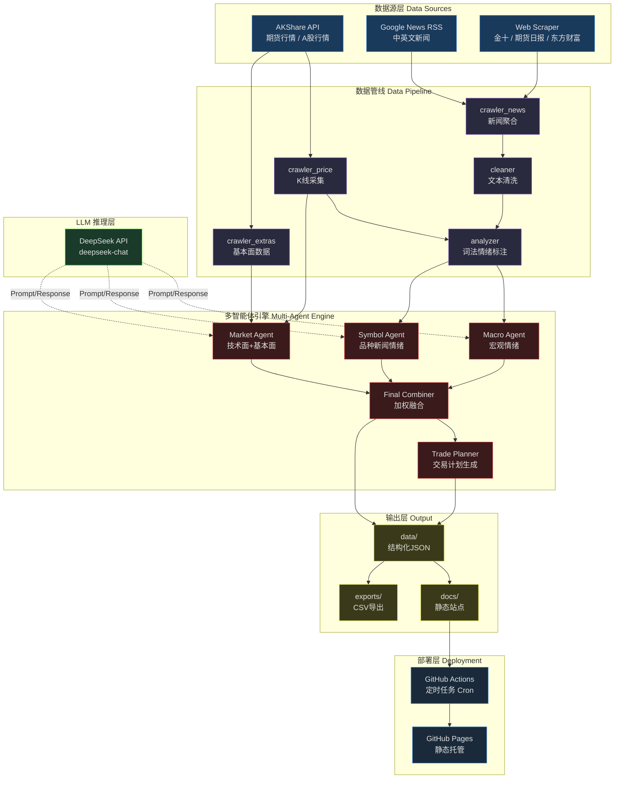
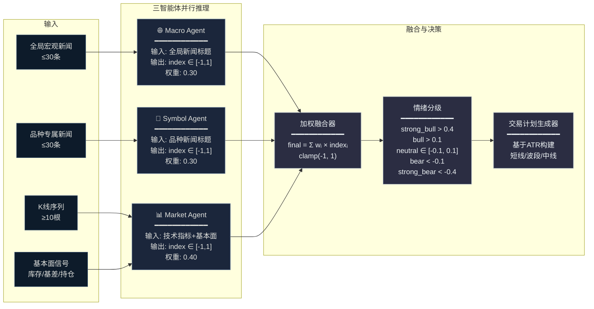
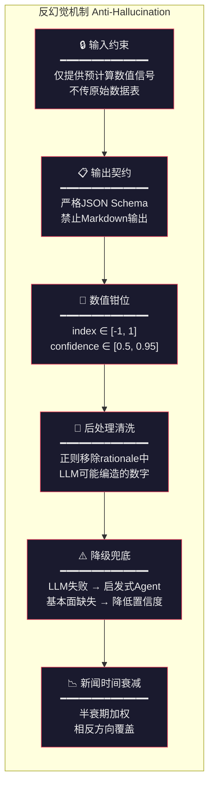

# SentiX · 深意·X

> **多源金融情绪分析引擎 — Multi-Agent Sentiment Intelligence for Futures & A-Shares**

---

## 项目简介

**SentiX（深意·X）** 是一个面向中国期货与A股市场的 **多智能体情绪分析系统**。系统每日自动采集行情数据、多语种新闻、基本面指标，通过三个独立的 LLM Agent 并行推理，输出量化情绪指数与结构化交易计划，最终生成专业级静态数据门户并自动部署。

### 核心特性

| 特性 | 描述 |
|------|------|
| **多资产覆盖** | 期货（黄金、原油、螺纹钢、沪深300股指、豆粕）+ A股（贵州茅台、宁德时代、中国平安），可随时扩展 |
| **三智能体架构** | Macro Agent / Symbol Agent / Market Agent 独立推理后加权融合 |
| **LLM + 启发式双模式** | DeepSeek LLM 为主，解析失败自动降级至词法启发式分析 |
| **反幻觉工程** | 6层防护：输入约束→输出契约→数值钳位→后处理清洗→降级兜底→时间衰减 |
| **全自动化** | GitHub Actions Cron 定时驱动 → 数据采集 → 分析 → 站点构建 → GitHub Pages 部署 |
| **零后端运维** | 纯静态站点 + JSON API，无服务器成本 |

---

## 系统架构



**图 1 · 系统架构总览** — 从数据源到部署的完整数据流。蓝色为数据源层、紫色为管线层、红色为智能体引擎、绿色为 LLM 层、黄色为输出层。

---

## 多智能体情绪分析引擎

系统的核心创新在于 **三智能体并行推理** 架构。每个 Agent 独立接收不同维度的输入信号，输出归一化的情绪指数 $\text{index} \in [-1, 1]$，最终通过可配置权重进行加权融合：

$$
\text{final\_index} = \text{clamp}\left(\sum_{i \in \{macro, symbol, market\}} w_i \cdot \text{index}_i,\ -1,\ 1\right)
$$

默认权重配置：$w_{macro} = 0.30,\ w_{symbol} = 0.30,\ w_{market} = 0.40$



**图 2 · 多智能体情绪分析架构** — 三路独立信号 → 加权融合 → 情绪分级 → 交易计划。

### Agent 详细说明

| Agent | 输入 | 推理模式 | 产出 |
|-------|------|----------|------|
| **Macro Agent** | 全球宏观新闻标题（关税、利率、地缘） | DeepSeek LLM / 词法启发式 | 宏观情绪指数 + 置信度 + ≤5条推理依据 |
| **Symbol Agent** | 品种关联新闻标题 | DeepSeek LLM / 词法启发式 | 品种情绪指数 + 置信度 + ≤5条推理依据 |
| **Market Agent** | 技术指标（MA20/MA60/ATR14/量比）+ 基本面（库存/基差/展期收益/持仓排名） | DeepSeek LLM / 技术启发式 | 市场数据情绪指数 + 置信度 + ≤5条推理依据 |

---

## 数据采集与部署流程

```mermaid
sequenceDiagram
    participant CRON as GitHub Actions<br/>Cron 定时触发
    participant CLI as cli.py<br/>命令调度
    participant PRICE as crawler_price<br/>行情采集
    participant NEWS as crawler_news<br/>新闻采集
    participant EXTRA as crawler_extras<br/>基本面采集
    participant LLM as DeepSeek API<br/>LLM推理
    participant AGG as aggregator<br/>数据聚合
    participant GEN as generator<br/>站点构建
    participant PAGES as GitHub Pages<br/>静态部署

    CRON->>CLI: python -m src.cli run-all
    
    rect rgb(20, 30, 50)
        Note over CLI,EXTRA: Phase 1: 数据采集
        CLI->>PRICE: fetch_kline(symbol, 180天)
        PRICE-->>CLI: K线序列 [{date, OHLCV}]
        CLI->>NEWS: fetch_news_bundle(global + symbol)
        NEWS-->>CLI: {global[], symbol[], merged[]}
        CLI->>EXTRA: fetch_extras(symbol) [仅期货]
        EXTRA-->>CLI: {inventory, basis, positions...}
    end

    rect rgb(30, 20, 20)
        Note over CLI,LLM: Phase 2: 多Agent分析
        CLI->>LLM: macro_agent(全局新闻)
        LLM-->>CLI: {index, confidence, rationale}
        CLI->>LLM: symbol_agent(品种新闻)
        LLM-->>CLI: {index, confidence, rationale}
        CLI->>LLM: market_agent(技术+基本面)
        LLM-->>CLI: {index, confidence, rationale}
        CLI->>CLI: combine_final(加权融合)
        CLI->>CLI: trade_plan(基于ATR)
    end

    rect rgb(20, 30, 20)
        Note over CLI,PAGES: Phase 3: 持久化与部署
        CLI->>AGG: upsert_symbol_day()
        AGG-->>CLI: data/symbols/{id}/days/{date}.json
        CLI->>AGG: write_latest()
        AGG-->>CLI: data/latest.json
        CLI->>GEN: build_site()
        GEN-->>CLI: docs/index.html + docs/s/*.html
        CLI->>PAGES: git push → auto deploy
        PAGES-->>CRON: ✓ 站点已更新
    end
```



**图 3 · 数据流时序图** — 三阶段流水线：数据采集 → 多Agent分析 → 持久化与部署。

---

## 反幻觉工程设计

在将 LLM 应用于金融分析场景时，**幻觉（Hallucination）** 是最大的工程风险。SentiX 设计了 6 层防护机制：



**图 4 · 反幻觉6层防护** — 从输入到输出的全链路幻觉控制。

### 防护层详解

1. **输入约束** — Market Agent 仅接收预计算的 `close`, `ma20`, `ma60`, `atr14`, `vol_ratio20` 等数值信号，而非原始 K 线 DataFrame，从根源减少 LLM 自行解读造成的误差。

2. **输出契约** — System Prompt 明确规定 JSON-only 输出格式 `{index, confidence, rationale[]}`，禁止 Markdown、自由文本等非结构化输出。

3. **数值钳位** — 所有 Agent 输出经过 `clamp()` 处理：
   - $\text{index} \in [-1.0,\ 1.0]$
   - $\text{confidence} \in [0.5,\ 0.95]$

4. **后处理清洗** — 对 LLM 返回的 `rationale` 文本使用正则表达式 `re.sub(r"(?<!\d)(-?\d+(?:\.\d+)?)(?!\d)", "", s)` 剥离数字，防止 LLM 编造不存在的技术指标数值。

5. **降级兜底** — LLM API 调用失败、返回非法 JSON 等异常情况下，自动切换至基于词频+技术指标的启发式 Agent，确保系统不会因 LLM 不可用而中断。基本面数据缺失时自动将 `confidence` 上限降至 0.75。

6. **新闻时间衰减** — 新闻权重随时间按半衰期衰减，最新 1 天新闻享受 1.25× 加成。对于方向对立的新闻主题（如加息/降息），最新方向自动覆盖旧信号。

---

## 技术栈

```
┌─────────────────────────────────────────────────────────────┐
│  前端渲染层                                                  │
│  Bootstrap 5.3 · Chart.js 4.4 · chartjs-chart-financial     │
│  Jinja2 模板 · 响应式设计 · 金融终端风格 UI                    │
├─────────────────────────────────────────────────────────────┤
│  数据采集层                                                  │
│  AKShare (期货主力/A股日K) · Google News RSS (中英双语)       │
│  Web Scraper (金十数据·期货日报·东方财富)                      │
├─────────────────────────────────────────────────────────────┤
│  分析推理层                                                  │
│  DeepSeek Chat API · 词法情绪分析(Lexicon) · ATR波动模型      │
│  三Agent加权融合 · 反幻觉6层防护                               │
├─────────────────────────────────────────────────────────────┤
│  部署运维层                                                  │
│  GitHub Actions Cron · GitHub Pages 静态托管                 │
│  零服务器 · 零数据库 · JSON文件存储                            │
└─────────────────────────────────────────────────────────────┘
```

### 核心依赖

| 库 | 用途 |
|----|------|
| `akshare` | 中国期货/A股行情数据 |
| `requests` | HTTP 请求（新闻/DeepSeek API） |
| `beautifulsoup4` | 网页新闻解析 |
| `feedparser` | RSS 新闻源解析 |
| `jinja2` | HTML 模板引擎 |
| `PyYAML` | YAML 配置文件 |
| `pandas` | 数据处理与 CSV 导出 |
| `Chart.js` | 前端 K 线/成交量/情绪图表 |

---

## 数据模型

### 每日快照 (`data/latest.json`)

```json
{
  "date": "2026-02-25",
  "updated_at": "2026-02-25T09:00:00+08:00",
  "symbols": [
    {
      "id": "gold",
      "name": "黄金",
      "asset": "futures",
      "sentiment_index": 0.35,
      "sentiment_band": "bull",
      "confidence": 0.72,
      "change_pct": 1.2,
      "close": 685.50,
      "volume": 128000,
      "open_interest": 450000,
      "agents": { "macro": {...}, "symbol": {...}, "market": {...} }
    }
  ]
}
```

### 情绪分级映射

| 区间 | 分级 | 含义 |
|------|------|------|
| $> 0.4$ | `strong_bull` | 强烈看涨 |
| $> 0.1$ | `bull` | 偏多 |
| $[-0.1, 0.1]$ | `neutral` | 中性 |
| $< -0.1$ | `bear` | 偏空 |
| $< -0.4$ | `strong_bear` | 强烈看跌 |

### 交易计划（ATR-Based）

系统基于 14 日 ATR (真实波幅) 自动生成三档交易计划：

| 档位 | 入场区间 | 止损 | 目标1 | 目标2 |
|------|---------|------|-------|-------|
| **短线** | ±0.5 ATR | 1.5 ATR | 1.0 ATR | 2.0 ATR |
| **波段** | ±1.0 ATR | 2.5 ATR | 2.0 ATR | 4.0 ATR |
| **中线** | ±1.5 ATR | 3.5 ATR | 3.0 ATR | 6.0 ATR |

---

## 项目结构

```
futusense/
├── config.yaml          # 全局配置（品种/新闻/LLM参数）
├── src/
│   ├── cli.py           # CLI入口：update-data / build-site / run-all
│   ├── crawler_price.py # 行情采集（AKShare）
│   ├── crawler_news.py  # 多源新闻采集（GNews/RSS/Web）
│   ├── crawler_extras.py# 基本面数据（仓单/基差/持仓）
│   ├── analyzer.py      # 词法情绪分析器
│   ├── agents.py        # 三Agent推理引擎 + 交易计划
│   ├── aggregator.py    # 数据聚合与JSON持久化
│   ├── fundamentals.py  # 基本面信号提取
│   ├── generator.py     # Jinja2静态站点生成器
│   ├── cleaner.py       # 文本清洗工具
│   └── utils.py         # 通用工具函数
├── templates/
│   ├── index.html.j2    # 首页模板（Ticker Tape + 分类表格）
│   └── detail.html.j2   # 品种详情页模板（K线 + Agent + 计划）
├── static/
│   ├── styles.css       # 金融终端风格CSS
│   └── app.js           # 前端交互与图表渲染
├── data/                # 运行时数据存储
│   ├── latest.json      # 最新快照
│   ├── symbols/         # 按品种/日期的历史数据
│   └── exports/         # CSV导出
└── docs/                # 生成的静态站点（GitHub Pages根目录）
```

---

## 快速开始

```bash
# 1. 克隆仓库
git clone https://github.com/your-username/futusense.git
cd futusense

# 2. 创建虚拟环境
python -m venv .venv && source .venv/bin/activate

# 3. 安装依赖
pip install -r requirements.txt
pip install -r requirements-akshare.txt

# 4. 配置 DeepSeek API Key
export DEEPSEEK_API_KEY="sk-your-key-here"

# 5. 运行（采集+分析+建站）
python -m src.cli --config config.yaml run-all

# 6. 本地预览
open docs/index.html
```

---

## 设计哲学

1. **Agent as Service** — 每个 Agent 是一个无状态函数，输入信号 → 输出结构化评分。易于测试、替换、并行化。

2. **LLM 是工具而非黑箱** — 对 LLM 输出执行严格的后处理、校验、钳位，将其视为一个需要"监管"的推理组件。

3. **零运维静态架构** — 所有状态均以 JSON 文件存储，通过 GitHub Actions 实现完全的无服务器自动化。无数据库、无后端进程、无运维成本。

4. **可观测的决策过程** — 每个 Agent 的推理依据（rationale）都被保留并展示在前端，用户可以追溯每一条分析的来源。

5. **优雅降级** — LLM 不可用时自动切换至启发式分析，确保系统 7×24 可用。

---

## 致谢

- [AKShare](https://github.com/akfamily/akshare) — 开源中国金融数据接口
- [DeepSeek](https://www.deepseek.com/) — 高性价比 LLM API
- [Chart.js](https://www.chartjs.org/) — 前端图表渲染
- [Bootstrap](https://getbootstrap.com/) — UI 组件框架

---

<p align="center">
  <em>SentiX · 深意·X — 用数据理解市场温度，用 Agent 解读情绪脉搏</em>
</p>

---

*本项目仅供技术研究与学习交流，所有分析结果和交易计划不构成任何投资建议。*
